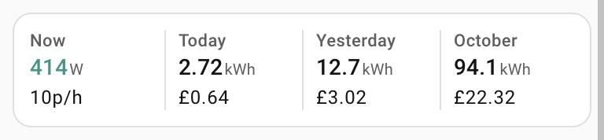
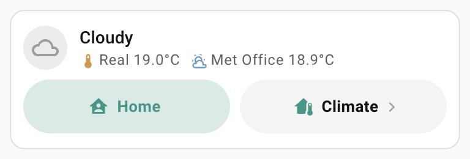
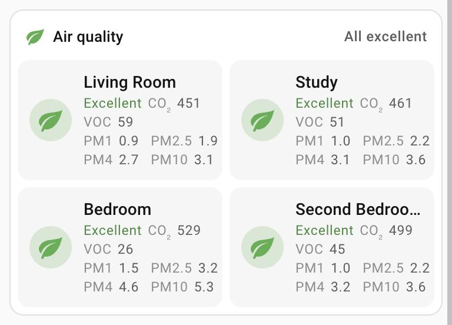
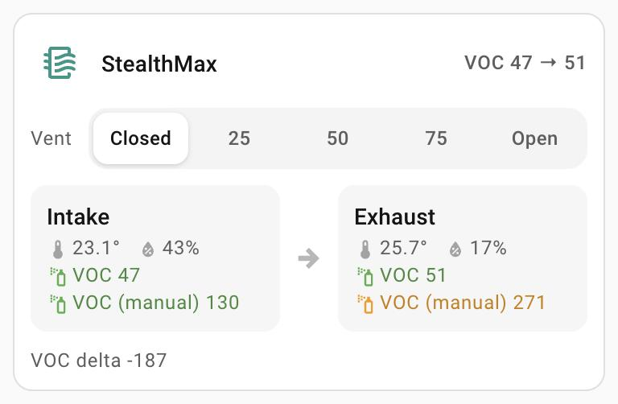

# Home Assistant custom cards

Small, self-contained Lovelace cards. Each card is a single JavaScript file with
no build step and no dependencies: the logic and styling live in the card, so
your dashboard config is just a list of entities.

They follow the look of Mushroom and the built-in tile cards (same greys,
colours and icon shapes), and anything that changes something important asks
first in a confirmation dialog.

| Card | What it does |
|---|---|
| [Home status](cards/home-status-card/README.md) | Presence, alarm switch, door, TV, climate and an ePaper message for a home, in one compact card. |
| [Room lights](cards/room-lights-card/README.md) | An "All lights" switch and a tile per room with temperature, humidity and light level; long-press a room for its lamps. |
| [Energy summary](cards/energy-summary-card/README.md) | Power now, today, yesterday and this month, each with its cost, in one compact row. |
| [Weather & presence](cards/weather-presence-card/README.md) | Weather with your own outdoor temperature, a presence pill and a link pill – the top of a climate section. |
| [Climate modes](cards/climate-modes-card/README.md) | Whole-house mode tiles (heating presets, aircon speeds…) with the active one highlighted. |
| [Air quality](cards/air-quality-card/README.md) | Every room's air in one card: status, CO₂ / PM2.5 / VOC, and a red glow when a room needs ventilating. |
| [Printer status](cards/printer-status-card/README.md) | A Klipper / Moonraker printer: state, power plug and watts, current job with thumbnail and time left (or totals), camera, and the buttons for the state. |
| [Printer temperatures](cards/printer-temps-card/README.md) | Heaters with target and power (glowing while heating), other temperatures and fans. |
| [MMU lanes](cards/mmu-lanes-card/README.md) | Happy Hare MMU lanes: loaded or empty, humidity and temperature per lane, drying fans, buffer state. |
| [Enclosure filter](cards/enclosure-filter-card/README.md) | Enclosure filter / vent: vent position selector, intake vs exhaust temperature, humidity and VOC. |

Related: the Tado X room card (`custom:tadox-room-card`) ships with the
[Tado X Proxy integration](https://github.com/igiannakas/ha-tadox-proxy), because it reads
that integration's thermostat attributes.

## Screenshots

Taken from a live dashboard at phone width, light theme. A few show example values (e.g. a print in progress).

<table>
  <tr>
    <td valign="top" width="50%"><a href="cards/home-status-card/README.md"><b>Home status</b></a><br></td>
    <td valign="top" width="50%"><a href="cards/energy-summary-card/README.md"><b>Energy summary</b></a><br></td>
  </tr>
  <tr>
    <td valign="top" width="50%"><a href="cards/room-lights-card/README.md"><b>Room lights</b></a><br></td>
    <td valign="top" width="50%"><a href="cards/weather-presence-card/README.md"><b>Weather & presence</b></a><br></td>
  </tr>
  <tr>
    <td valign="top" width="50%"><a href="cards/climate-modes-card/README.md"><b>Climate modes</b></a><br></td>
    <td valign="top" width="50%"><a href="cards/air-quality-card/README.md"><b>Air quality</b></a><br></td>
  </tr>
  <tr>
    <td valign="top" width="50%"><a href="cards/printer-status-card/README.md"><b>Printer status</b></a><br></td>
    <td valign="top" width="50%"><a href="cards/printer-temps-card/README.md"><b>Printer temperatures</b></a><br></td>
  </tr>
  <tr>
    <td valign="top" width="50%"><a href="cards/mmu-lanes-card/README.md"><b>MMU lanes</b></a><br></td>
    <td valign="top" width="50%"><a href="cards/enclosure-filter-card/README.md"><b>Enclosure filter</b></a><br></td>
  </tr>
</table>

## Dependencies

The cards themselves need nothing else: no Mushroom, no card-mod, no build step.
Confirmations are built in (each card shows its own dialog), so no pop-up card such as
Bubble Card is needed. One option leans on another card if you use it:

| Used for | Needs | Notes |
|---|---|---|
| The camera inside the Printer status card (`camera_card`) | Whatever card you put there | Any card works; the screenshots use [Advanced Camera Card](https://github.com/dermotduffy/advanced-camera-card). Leave `camera_card` out and the card has no camera. |

## Installing (HACS)

All cards come as one file, `dist/homeassistant-custom-cards.js`.

1. **HACS → ⋮ → Custom repositories**: add
   `https://github.com/igiannakas/homeassistant-custom-cards`, type **Dashboard**.
2. Open **Home Assistant custom cards** in HACS and **Download**. HACS adds the
   dashboard resource (`/hacsfiles/homeassistant-custom-cards/homeassistant-custom-cards.js`)
   for you.
3. Reload the browser tab (or pull down to refresh in the app).

Updates show up in HACS like any other card once new commits are pushed.

Without HACS: copy `dist/homeassistant-custom-cards.js` to `config/www/` and add
it as a **JavaScript module** resource (`/local/homeassistant-custom-cards.js?v=1`,
changing `?v=` on every update).

## Repository layout

```
cards/<card-name>/<card-name>.js   the card's source
cards/<card-name>/README.md        options and behaviour
tests/<card-name>.test.js          behaviour tests (real card code in jsdom)
dist/homeassistant-custom-cards.js all cards in one file, for HACS (npm run build)
hacs.json                          tells HACS which file to install
docs/screenshots/                  README images
skills/ha-custom-card-design/      the design and build playbook these cards follow (a Claude skill)
```

## Design playbook

[`skills/ha-custom-card-design`](skills/ha-custom-card-design/SKILL.md) is the playbook these cards were built with: the
Mushroom-matched design tokens, the interaction rules (every value opens its own more-info,
confirm only what moves hardware or cuts power), the engineering rules that keep taps reliable on
phones, how to test, ship through HACS and update a dashboard safely, and a log of the feedback each
rule came from. It is written as a [Claude skill](https://docs.claude.com/en/docs/agents-and-tools/agent-skills/overview)
but reads fine as a plain style guide; `references/card-skeleton.js` is a working card to start from.

## Development

```bash
npm install     # jsdom, for the tests
npm run build   # rebuild dist/ after changing a card (commit it too)
npm test        # syntax check, every card's tests, and a check that dist/ is up to date
```

Conventions for new cards:

- One file, plain `HTMLElement` + shadow DOM, no external imports.
- Register only after Home Assistant's own `home-assistant` element is defined
  (`customElements.whenDefined("home-assistant")`), then define through
  `window.customElements` – Home Assistant swaps in a scoped registry while it
  starts, and a card defined earlier is reported as "custom element doesn't exist".
- Use theme variables (`--grey-color`, `--red-color`, …) rather than fixed colours,
  so light and dark themes both work.
- Confirm anything with consequences (alarms, boosts, locks) in a dialog.

## License

GPL-3.0 – see [LICENSE](LICENSE).
