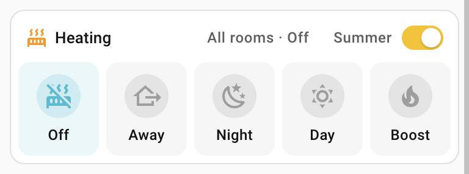

# Climate modes card

`custom:climate-modes-card` – whole-house mode shortcuts in one card.

<p>
  
</p>

- A label row (icon, title) with what the rooms are on – "All rooms · Night",
  or "Mixed" when they differ – and optionally a switch next to it (e.g.
  summer mode, or an automatic aircon automation). The switch toggles, or runs
  `switch_tap_action` instead – which can ask first (see below).
- A tile per mode. The active one glows in its own colour.
- A mode is active when **all** `thermostats` share its `preset`, or when its
  own `active.entity` is in `active.state` (handy for an aircon speed helper).
- Tapping a tile runs its `tap_action`: `perform-action` (scripts, services),
  `navigate`, `more-info`, `toggle`. Errors (e.g. heating locked in summer mode) show as a
  toast.
- **Ask first:** add `confirmation` to any tap action (a tile's or the switch's). The card
  shows its own confirm dialog in the Bubble Card look – the tile's icon and colour, a
  title, an optional subject line and text, and Confirm / Cancel. Escape or a tap outside
  cancels. Every text may be a Home Assistant template, rendered when the dialog opens.
  No pop-up card is needed.

  | `confirmation` key | Default |
  |---|---|
  | `true` | Just the tile's name |
  | `title` | The tile's name (the switch's label for the switch) |
  | `icon` | The tile's icon |
  | `subject` / `subject_icon` | none / the card's icon – a bold line, e.g. "All rooms" |
  | `text` | none – what will happen |
  | `confirm_label` | The title |

## Configuration

```yaml
type: custom:climate-modes-card
title: Heating
icon: mdi:radiator
icon_color: orange
thermostats:
  - climate.living_room_thermostat
  - climate.master_bedroom_thermostat
  - climate.second_bedroom_thermostat
  - climate.study_thermostat
modes:
  - name: "Off"
    icon: mdi:radiator-off
    color: cyan
    preset: frost_protection
    tap_action: { action: perform-action, perform_action: script.heating_mode_frost_protection }
  - name: Away
    icon: mdi:home-export-outline
    color: blue
    preset: away
    tap_action:
      action: perform-action
      perform_action: script.heating_mode_away
      confirmation:
        title: Away mode
        subject: All rooms
        text: Every room drops to its away temperature until you pick another mode.
        confirm_label: Set to Away
switch: input_boolean.heating_summer_mode
switch_name: Summer
switch_color: amber
switch_tap_action:
  action: toggle
  confirmation:
    title: "{{ 'Turn off' if is_state('input_boolean.heating_summer_mode', 'on') else 'Turn on' }} summer mode"
    text: Every thermostat is locked at 5 °C while summer mode is on.
```

Cooling example (entity + state modes and a switch in the label row):

```yaml
type: custom:climate-modes-card
title: Cooling
icon: mdi:snowflake
icon_color: blue
switch: automation.85_turn_on_aircon_when_hot
modes:
  - name: "Off"
    icon: mdi:snowflake-off
    active: { entity: input_number.aircon_state, state: ["0", "0.0"] }
    tap_action: { action: perform-action, perform_action: script.aircon_off }
```

| Option | What it is |
|---|---|
| `title`, `icon`, `icon_color` | Label row. Colours are Home Assistant colour names (`orange`, `cyan`, …) or any CSS colour. |
| `thermostats` | Climate entities whose shared preset picks the active mode. |
| `switch`, `switch_name`, `switch_color` | Optional switch in the label row, after the status. |
| `switch_tap_action` | What tapping the switch does instead of toggling, e.g. `{ action: toggle, confirmation: { title: Summer mode } }` to ask first. |
| `modes[].name`, `icon`, `color` | The tile. |
| `modes[].preset` | Active when every thermostat has this preset. |
| `modes[].active` | `{ entity, state }` – active when the entity is in that state (one value or a list). |
| `modes[].tap_action` | What a tap does (see above). |

In the visual editor the modes are edited as YAML.
