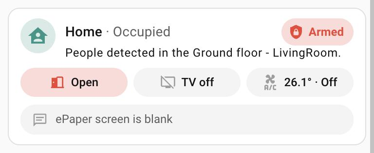

# Home status card

`custom:home-status-card` – one compact card for a home you look after
remotely.

<p>
  
</p>

## Configuration

Everything below can be set in the visual editor (Add card → Home status
card); nested options sit in collapsible Presence, TV and Climate sections.

```yaml
type: custom:home-status-card
name: Greece
presence:
  occupied: input_text.occupied_rooms_greece
  last_room: input_text.last_occupied_room_greece
  last_seen: input_datetime.last_detection_timestamp_greece
  navigation_path: /dashboard-cctv/0
alarm: input_boolean.greece_enable_alarm
door: sensor.downstairslivingroomside_living_room_door_open_classification
tv:
  entity: binary_sensor.greece_tv_state
  navigation_path: /lovelace/greece-tv
climate:
  temperature: sensor.ground_floor_living_room_temperature
  state: input_text.greece_climate_control_state
  navigation_path: /lovelace/greece-climate
message: sensor.epaper_epaper_screen_text
```

| Option | What it is |
|---|---|
| `name` | Title at the top. |
| `icon` | Optional; replaces the house icon. |
| `presence.occupied` | Text entity listing where people are now. Empty means the house is empty. Shown exactly as stored. |
| `presence.last_room` | Text entity with the room someone was last seen in. |
| `presence.last_seen` | `input_datetime` with when that was. |
| `presence.navigation_path` | Where tapping the title goes (e.g. the camera dashboard). Without it, tapping opens the `occupied` entity. |
| `alarm` | `input_boolean` or `switch` that arms the alarm. |
| `door` | Door sensor; any state containing `open` (or `on`) counts as open. |
| `tv.entity` | TV on/off entity. `tv.navigation_path` is where tapping goes. |
| `climate.temperature` | Temperature sensor shown on the climate button. |
| `climate.state` | Text describing the AC – anything with `cool` or `heat` in it colours the button; `off` shows "Off". |
| `climate.navigation_path` | Where tapping the climate button goes. |
| `message` | ePaper (or any text) sensor shown on the last line. |

Any of `alarm`, `door`, `tv`, `climate` and `message` can be left out; the card
drops that part.

## Behaviour

**Presence (title line)**

- Occupied – teal house, the `occupied` text underneath.
- Empty, someone seen within the last hour – orange.
- Empty longer than that – red.
- When empty, the line reads "A person was last seen in the *room* today at 16:09"
  (or "yesterday at …", "on Oct 03 at …").

**Alarm switch** – red "Armed" or grey "Disarmed". Tapping asks first; the
dialog explains that the CCTV alarm system starts or stops sending push
notifications.

**Status buttons** – grey while normal:

| Button | Colour when it needs attention | Tap |
|---|---|---|
| Door | red when open | opens the door's details |
| TV | amber when on | `tv.navigation_path` |
| Climate | blue when cooling, red when heating | `climate.navigation_path` |

**ePaper line** – always shown. The message is quoted and wraps in full;
"ePaper screen is blank" when empty. Tapping opens the sensor's details
(history).

The card refreshes once a minute on its own so the house turns red an hour
after the last sighting even if nothing else changes.
