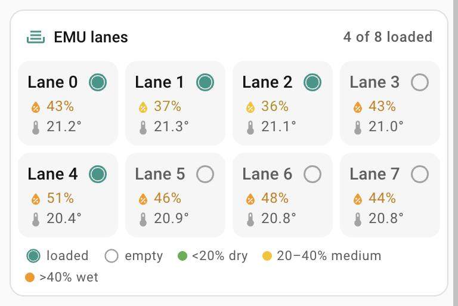

# MMU lanes card

`custom:mmu-lanes-card` – every lane of a Happy Hare MMU (e.g. an EMU) at a glance.

<p>
  
</p>

- **Lane**: loaded (filled) or empty (outline, name greyed), humidity coloured
  dry (green) / medium (amber) / wet (orange), temperature, and a fan icon while
  the lane is drying.
- **Label row**: how many lanes are loaded.
- Lanes are counted automatically. Two columns on a narrow card.
- Tap the humidity or temperature for that sensor's more-info; the rest of the lane
  opens its humidity sensor.

## Configuration

```yaml
type: custom:mmu-lanes-card
prefix: voron
title: EMU lanes
```

| Option | What it is |
|---|---|
| `prefix` | **Required.** The Moonraker integration prefix. Per lane `n` the card reads `binary_sensor.<prefix>_mmu_entry_<n>`, `sensor.<prefix>_unit<u>_env<n>_humidity`, `_env<n>_temp` and `_fan<n>`. |
| `title` | Label row title. Default `MMU lanes`. |
| `unit` | MMU unit number, default 0. |
| `lanes` | Number of lanes; default is every lane found. |
| `names` | List of lane names, e.g. `[PLA black, PETG white]`. |
| `columns` | Lanes per row, default 4 (2 on a narrow card). |
| `humidity_thresholds` | `[dry, wet]`, default `[20, 40]`: below 20 % dry, 20–40 % medium, above 40 % wet. |
| `legend` | Show the legend line, default `true`. |
