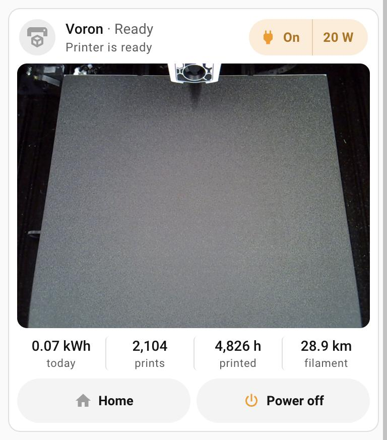
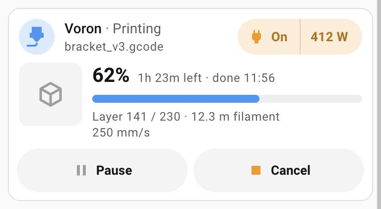

# Printer status card

`custom:printer-status-card` – a Klipper / Moonraker printer at a glance.

<table>
  <tr>
    <td valign="top"><br><sub>Idle, with the camera card</sub></td>
    <td valign="top"><br><sub>While printing (example values)</sub></td>
  </tr>
</table>

- **Header**: state in its colour (Off, Ready, Printing, Paused, Complete,
  Cancelled, Error) and the printer's message – or the file name during a job.
- **Power pill**: the plug and its live watts. Tap On / Off to switch the plug:
  turning it on is immediate, turning it off asks first, and warns in red while a
  print is running. Tap the watts for the power sensor.
- **Job**: thumbnail, progress, time left and finish time, layer, filament used and
  speed. Stays up after the print as "Done" / "Cancelled".
- **Idle**: energy used today, prints, hours printed and kilometres of filament.
- **Camera**: any card you like (e.g. Frigate card), shown inside this one.
- **Buttons** follow the state: Pause + Cancel while printing, Resume + Cancel when
  paused, Home + Power off when idle. Home, Cancel and Power off ask first. There
  is no emergency stop on purpose.
- **Tap any value** (progress, time left, finish time, layer, filament, speed,
  today's energy, totals, the state) for its own more-info.

## Configuration

```yaml
type: custom:printer-status-card
name: Voron
prefix: voron
power_switch: switch.voron
power_sensor: sensor.tasmota_energy_power_2
energy_today: sensor.tasmota_energy_today_2
power_off_script: script.power_off_3d_printer
camera_card:
  type: custom:frigate-card
  cameras:
    - camera_entity: camera.voron_camera
```

| Option | What it is |
|---|---|
| `prefix` | **Required.** The Moonraker integration prefix. The card reads `sensor.<prefix>_current_print_state`, `_printer_state`, `_printer_message`, `_current_display_message`, `_filename`, `_progress`, `_print_time_left`, `_print_eta`, `_current_layer`, `_total_layer`, `_filament_used`, `_print_speed`, `_totals_jobs`, `_totals_print_time`, `_totals_filament_used`, and presses `button.<prefix>_pause_print`, `_resume_print`, `_cancel_print`, `_home_all_axes`. |
| `name` | Shown in the header. Default `Printer`. |
| `power_switch` | The printer's smart plug (`switch` or `input_boolean`). Without it there is no pill and the printer counts as powered. |
| `power_sensor` | Live watts for the pill. |
| `energy_today` | kWh today, shown when idle. |
| `power_off_script` | A `script` or `button` that shuts the printer down safely and then cuts the plug. Without it there is no Power off button. |
| `camera_card` | Any card config, rendered inside the card. |
| `thumbnail` | Camera entity with the job thumbnail. Default `camera.<prefix>_thumbnail`. |
