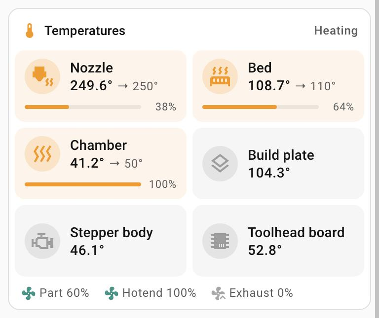

# Printer temperatures card

`custom:printer-temps-card` – heaters, other temperatures and fans of a Klipper /
Moonraker printer.

<p>
  <br><sub>Heating (example values)</sub>
</p>

- **Heater tiles**: temperature, then "Off" or "→ target", and a power bar with
  the heater power at its end. A heater that is on **glows orange**, like a lit room on the lights card.
- **Readings**: other temperatures as plain tiles.
- **Fans**: one line, coloured while running.
- **Label row**: "All heaters off", "Heating" or "At temperature" (every heater
  that is on is within 2° of its target).
- Tap a value – temperature, target, power, fan – for its own more-info; the rest
  of a tile opens its temperature. Sensors that do not exist are left out.

## Configuration

```yaml
type: custom:printer-temps-card
prefix: voron
```

| Option | What it is |
|---|---|
| `prefix` | **Required.** The Moonraker integration prefix. |
| `title` | Label row title. Default `Temperatures`. |
| `heaters` | List of `{name, heater, icon}` – the card reads `sensor.<prefix>_<heater>_temperature`, `number.<prefix>_<heater>_target`, `sensor.<prefix>_<heater>_power` – or `{name, temperature, target, power}` with entity ids. Default Nozzle (`extruder`), Bed (`bed`), Chamber (`heater_chamber`). |
| `readings` | List of `{name, sensor, icon}` (`sensor.<prefix>_<sensor>`) or `{name, entity}`. Default Build plate, Stepper body, Toolhead board. |
| `fans` | List of `{name, entity, icon}`; `{p}` in the entity id becomes the prefix. Default Part (`number.{p}_fan_speed`), Hotend, Exhaust. `[]` hides the line. |
