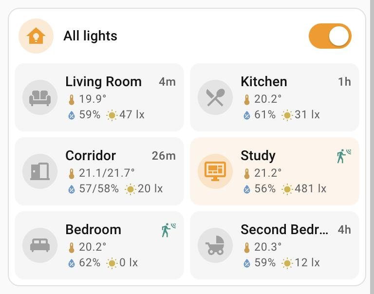
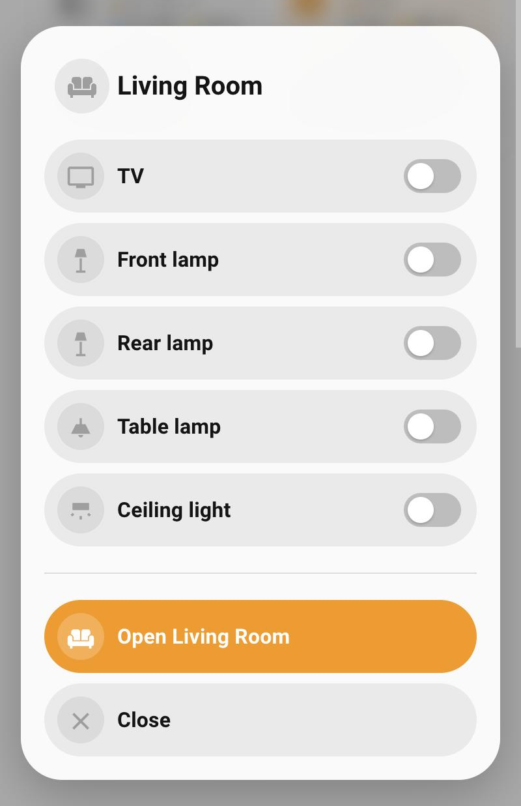

# Room lights card

`custom:room-lights-card` – all your rooms' lights in one card.

<table>
  <tr>
    <td valign="top"></td>
    <td valign="top"><br><sub>Hold a room for its lamps</sub></td>
  </tr>
</table>

- **All lights** (header): one tap turns everything off if anything is on,
  otherwise turns everything on. No confirmation.
- **Room tile**: tap switches the room; tap its icon to open the room's
  dashboard; long-press lists the room's lamps with a switch each (a room
  that is a single light lists just that light, unless you set `lamps`).
- Icon orange when the room's lights are on, grey when off. A red badge shows
  an open window.
- **Presence** (with `occupancy`), on the same line as the room name: a teal
  motion-sensor icon while someone is there, otherwise how long since someone was (`12m`,
  `6h`, `3d+`). This comes from the sensor's history, so a Home Assistant
  restart does not reset it. If the lights are on and the room has been empty
  for `empty_warning` minutes (default 2), it turns amber with a motion-sensor-off
  icon – lights left on in an empty room.
- In the long-press list each lamp has the same icon as on the room's own
  dashboard view (`navigation_path`), so the two always match.
- Temperature, humidity and light level each have their own icon (T, H and L above). A room can
  have more than one sensor of each kind: they are shown in order, for example
  `21.1/21.8°`.
- Every tile has the same height. On a phone, temperature sits on one line and
  humidity + light level on the next; on wider screens it is all one line.

## Configuration

Everything can be set in the visual editor: each room is a collapsible section
with its own fields (several temperature, humidity or light sensors each), and
buttons to add, reorder and remove rooms.

```yaml
type: custom:room-lights-card
entity: group.home_lights
rooms:
  - name: Living Room
    icon: mdi:sofa
    entity: light.living_room_lights
    navigation_path: /lovelace/living-room
    temperature: sensor.living_room_air_quality_temperature
    humidity: sensor.living_room_air_quality_humidity
    illuminance: sensor.living_room_air_quality_illuminance
    occupancy: binary_sensor.living_room_combined_presense
    window: binary_sensor.living_room_air_quality_open_window_detected
  - name: Corridor
    icon: mdi:door-open
    entity: group.corridor_downstairs_upstairs_lights
    navigation_path: /lovelace/corridor
    temperature:
      - sensor.corridor_temperature_and_humidity_sensor_temperature
      - sensor.upstairs_corridor_temperature_and_humidity_sensor_temperature
    humidity:
      - sensor.corridor_temperature_and_humidity_sensor_humidity
      - sensor.upstairs_corridor_temperature_and_humidity_sensor_humidity
    illuminance: sensor.corridor_motion_sensor_illuminance
```

| Option | What it is |
|---|---|
| `entity` | Group (or light) the header switch controls. Leave out to hide the header. |
| `name` | Header label. Default `All lights`. |
| `empty_warning` | Minutes before lights on in an empty room are flagged. Default 2 (0 = at once). |
| `columns` | Tiles per row, default 2. |
| `rooms[].entity` | The room's light, switch or group. |
| `rooms[].name`, `rooms[].icon` | Shown on the tile. |
| `rooms[].navigation_path` | Where tapping the icon goes. Without it, the icon toggles like the rest of the tile. |
| `rooms[].temperature`, `humidity`, `illuminance` | One sensor or a list. Leave out to hide that reading. |
| `rooms[].occupancy` | Occupancy / presence binary sensor for the presence indicator. |
| `rooms[].window` | Binary sensor; a red badge shows while it is on. |
| `rooms[].lamps` | Optional list of entities for the long-press sheet. By default the room entity's own members are used. |

In the long-press sheet, the room's name is taken off each lamp's name, so
"Front living room lamp" in Living Room shows as "Front lamp".
